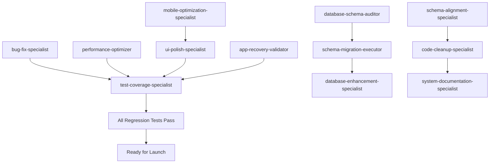

# 🤖 Agent Task Assignments - v2.1 Pre-Launch

## 🎯 Mission Critical Tasks by Agent

---

## 1️⃣ **bug-fix-specialist**
### Priority: CRITICAL - Data Corruption & Race Conditions
```
Fix the critical concurrent editing bug that causes data corruption. Multiple users editing the same schedule entry simultaneously results in lost data.

Tasks:
1. Implement optimistic locking on schedule_entries table:
   - Add 'version' INTEGER column with default 1
   - Update all UPDATE queries to check version: WHERE id = ? AND version = ?
   - Increment version on successful update
   - Return specific error on version mismatch

2. Add retry mechanism with exponential backoff:
   - Max 3 retries with 1s, 2s, 4s delays
   - Show "Someone else is editing" notification
   - Auto-refresh and merge changes

3. Create regression tests in __tests__/concurrent-editing.test.ts:
   - Test simultaneous updates from 2 users
   - Test version mismatch handling
   - Test retry mechanism
   - Test UI feedback during conflicts

4. Fix the "undefined team member" bug when switching teams rapidly

5. Fix the export memory leak causing browser crashes with 1000+ rows

File locations: 
- src/lib/database.ts
- src/hooks/useSchedule.ts
- src/components/ScheduleGrid.tsx
- supabase/migrations/003_add_versioning.sql
```

---

## 2️⃣ **database-schema-auditor**
### Priority: CRITICAL - Data Integrity & Constraints
```
Audit and fix critical database schema issues that risk data integrity.

Tasks:
1. Add missing critical constraints:
   ```sql
   -- Prevent duplicate entries
   ALTER TABLE schedule_entries 
   ADD CONSTRAINT unique_member_date UNIQUE(member_id, entry_date);
   
   -- Validate hours values
   ALTER TABLE schedule_entries 
   ADD CONSTRAINT valid_hours CHECK (hours IN (0, 0.5, 1));
   
   -- Enforce reason for absences
   ALTER TABLE schedule_entries 
   ADD CONSTRAINT reason_required 
   CHECK ((hours < 1 AND reason IS NOT NULL) OR hours = 1);
   ```

2. Create audit_logs table for compliance:
   ```sql
   CREATE TABLE audit_logs (
     id UUID PRIMARY KEY DEFAULT gen_random_uuid(),
     user_id UUID NOT NULL,
     action VARCHAR(50) NOT NULL,
     table_name VARCHAR(50) NOT NULL,
     record_id UUID NOT NULL,
     old_values JSONB,
     new_values JSONB,
     ip_address INET,
     user_agent TEXT,
     created_at TIMESTAMP DEFAULT NOW()
   );
   ```

3. Add database triggers for automatic audit logging

4. Create regression test suite:
   - Test constraint violations
   - Test audit log generation
   - Test cascade deletes
   - Test data integrity after migrations

5. Document all schema changes in SCHEMA_CHANGELOG.md

Files:
- supabase/migrations/004_add_constraints.sql
- supabase/migrations/005_audit_system.sql
- __tests__/database-integrity.test.ts
```

---

## 3️⃣ **performance-optimizer**
### Priority: HIGH - App is slow with 50+ users
```
The app becomes unusable with 50+ concurrent users. Dashboard takes 10+ seconds to load.

Tasks:
1. Create missing database indexes for 10x query improvement:
   ```sql
   CREATE INDEX CONCURRENTLY idx_schedule_member_date 
   ON schedule_entries(member_id, entry_date) 
   WHERE deleted_at IS NULL;
   
   CREATE INDEX CONCURRENTLY idx_schedule_sprint 
   ON schedule_entries(sprint_id, entry_date);
   
   CREATE INDEX CONCURRENTLY idx_team_members_active 
   ON team_members(team_id, is_active);
   ```

2. Fix N+1 query problem in team loading:
   - Replace 20 individual queries with single JOIN
   - Implement query result caching (5 min TTL)
   - Use React Query for smart caching

3. Optimize bundle size (currently 2.3MB):
   - Code split by route
   - Lazy load heavy components
   - Tree shake unused imports
   - Target: < 500KB initial bundle

4. Add performance monitoring:
   - Web Vitals tracking
   - Custom metrics for key operations
   - Performance regression tests

5. Create load tests simulating 100+ concurrent users

Files:
- src/lib/queries.ts (refactor all queries)
- next.config.js (add optimization)
- __tests__/performance/load-test.js
```

---

## 4️⃣ **mobile-optimization-specialist**
### Priority: HIGH - Mobile experience is broken
```
Mobile users can't use the app effectively. Buttons too small, tables don't scroll, exports fail.

Tasks:
1. Fix critical mobile UI issues:
   - Set ALL touch targets to minimum 44x44px
   - Fix table horizontal scroll (currently broken)
   - Implement swipe gestures for week navigation
   - Fix modal overlays on small screens

2. Implement mobile-specific features:
   - Bottom navigation bar for mobile
   - Pull-to-refresh for data updates
   - Native share API for exports (not download)
   - Haptic feedback for actions

3. Fix responsive breakpoints:
   ```css
   /* Add proper breakpoints */
   @media (max-width: 640px) /* Mobile */
   @media (max-width: 768px) /* Tablet */
   @media (max-width: 1024px) /* Small desktop */
   ```

4. Test on real devices:
   - iPhone 12/13/14 (Safari)
   - Samsung Galaxy (Chrome)
   - iPad (Safari & Chrome)

5. Create visual regression tests for all screen sizes

Files:
- src/styles/mobile.css (new file)
- src/components/MobileNav.tsx (new)
- src/hooks/useMobileDetect.ts (new)
- All component files for touch target fixes
```

---

## 5️⃣ **ui-polish-specialist**  
### Priority: HIGH - No user feedback on actions
```
Users don't know if their changes saved. No loading states, no success feedback, no error messages.

Tasks:
1. Implement comprehensive feedback system:
   - Loading spinners for ALL async operations
   - Success toast notifications (auto-dismiss 3s)
   - Error messages with recovery actions
   - Progress bars for long operations (exports)

2. Add connection status indicator:
   - Green dot: Connected & synced
   - Yellow dot: Syncing
   - Red dot: Offline/Error
   - Implement reconnection UI

3. Create Undo/Redo system:
   - Command pattern for state changes
   - Visual undo/redo buttons
   - Keyboard shortcuts (Ctrl+Z/Y)
   - Show "Change undone" toast
   - Persist undo history for session

4. Polish visual design:
   - Add subtle animations (framer-motion)
   - Improve color contrast for accessibility
   - Add hover states for all interactive elements
   - Implement dark mode support

5. Create Storybook for all UI components

Files:
- src/components/Toast.tsx (new)
- src/components/LoadingStates.tsx (new)
- src/hooks/useUndoRedo.ts (new)
- src/components/ConnectionStatus.tsx (new)
```

---

## 6️⃣ **test-coverage-specialist**
### Priority: CRITICAL - No tests = No confidence
```
Zero test coverage. We're deploying blind. Create comprehensive test suite with focus on regression prevention.

Tasks:
1. Create unit tests (target 80% coverage):
   - Business logic functions
   - Date/sprint calculations
   - Permission checks
   - Data transformations

2. Create integration tests:
   - API endpoints
   - Database operations
   - Real-time subscriptions
   - Export functionality

3. Create E2E regression test suite:
   ```javascript
   // Critical user journeys that must never break:
   - New user complete flow
   - Manager editing team member
   - COO viewing dashboard
   - Export with 1000+ rows
   - Sprint boundary transitions
   - Concurrent user edits
   ```

4. Set up continuous testing:
   - Pre-commit hooks with Husky
   - GitHub Actions for CI/CD
   - Automated regression tests on PR
   - Performance regression alerts

5. Create test data generators and fixtures

Files:
- __tests__/regression/critical-paths.test.ts
- __tests__/unit/**.test.ts
- __tests__/integration/**.test.ts
- .github/workflows/test.yml
- jest.config.js
```

---

## 7️⃣ **schema-migration-executor**
### Priority: HIGH - Migrations could break production
```
Execute and validate all database migrations safely without data loss.

Tasks:
1. Create migration rollback scripts for every migration:
   - Each UP migration needs corresponding DOWN
   - Test rollback procedures
   - Document rollback process

2. Implement safe migration execution:
   - Create pre-migration backups
   - Run migrations in transaction
   - Validate data integrity post-migration
   - Zero-downtime migration strategy

3. Create these critical migrations:
   ```sql
   -- 006_add_soft_deletes.sql
   ALTER TABLE schedule_entries ADD COLUMN deleted_at TIMESTAMP;
   ALTER TABLE team_members ADD COLUMN deleted_at TIMESTAMP;
   
   -- 007_add_team_settings.sql
   CREATE TABLE team_settings (
     team_id UUID PRIMARY KEY,
     sprint_duration INTEGER DEFAULT 14,
     week_start_day INTEGER DEFAULT 0,
     require_reasons BOOLEAN DEFAULT true
   );
   ```

4. Create migration testing framework:
   - Test migrations on copy of production data
   - Verify no data loss
   - Check performance impact

5. Document migration procedures in MIGRATIONS.md

Files:
- supabase/migrations/*.sql
- scripts/migrate.js
- scripts/rollback.js
- __tests__/migrations/*.test.ts
```

---

## 8️⃣ **database-enhancement-specialist**
### Priority: MEDIUM - Optimize for scale
```
Enhance database for better performance and future scaling to 500+ users.

Tasks:
1. Implement materialized views for dashboards:
   ```sql
   CREATE MATERIALIZED VIEW team_sprint_summary AS
   SELECT 
     team_id,
     sprint_id,
     COUNT(DISTINCT member_id) as member_count,
     SUM(hours) as total_hours,
     AVG(hours) as avg_hours
   FROM schedule_entries
   GROUP BY team_id, sprint_id;
   
   -- Refresh every hour
   ```

2. Implement database partitioning:
   - Partition schedule_entries by year
   - Archive old data (>1 year)
   - Improve query performance

3. Add caching layer:
   - Redis for session data
   - Cache frequently accessed queries
   - Implement cache invalidation strategy

4. Optimize slow queries (use EXPLAIN ANALYZE):
   - Dashboard aggregations
   - Export queries
   - Team overview queries

5. Set up database monitoring and alerts

Files:
- supabase/migrations/008_materialized_views.sql
- src/lib/cache.ts (new)
- docker-compose.yml (add Redis)
```

---

## 9️⃣ **app-recovery-validator**
### Priority: CRITICAL - No error recovery
```
When app crashes, users lose all work. Implement comprehensive error recovery.

Tasks:
1. Implement React Error Boundaries:
   ```jsx
   class ErrorBoundary extends Component {
     - Catch all component errors
     - Log to error service
     - Show recovery UI
     - Allow retry without refresh
   }
   ```

2. Add auto-save and recovery:
   - Save to localStorage every 5 seconds
   - Recover unsaved changes on reload
   - Show "Recovered unsaved changes" banner
   - Sync when connection restored

3. Implement offline mode:
   - Service Worker for offline access
   - Queue changes in IndexedDB
   - Sync when back online
   - Show offline indicator

4. Add session recovery:
   - Persist user session
   - Recover after browser crash
   - Handle expired tokens gracefully

5. Create chaos testing suite:
   - Random network failures
   - Component crashes
   - Memory pressure
   - Validate recovery works

Files:
- src/components/ErrorBoundary.tsx
- src/workers/service-worker.js
- src/hooks/useAutoSave.ts
- src/lib/recovery.ts
```

---

## 🔟 **code-cleanup-specialist**
### Priority: MEDIUM - Tech debt slowing development
```
Codebase has accumulated technical debt. Clean up for maintainability.

Tasks:
1. Remove dead code:
   - Find and remove unused components
   - Remove commented code blocks
   - Clean up unused imports
   - Remove duplicate functions

2. Refactor problematic patterns:
   - Fix prop drilling (use Context)
   - Split large components (>300 lines)
   - Extract custom hooks
   - Standardize naming conventions

3. Improve TypeScript usage:
   - Remove all 'any' types
   - Add proper interfaces
   - Enable strict mode
   - Fix type errors

4. Standardize code style:
   - Configure ESLint rules
   - Set up Prettier
   - Add pre-commit hooks
   - Fix all linting errors

5. Update dependencies:
   - Upgrade to latest stable versions
   - Remove unused packages
   - Check for vulnerabilities
   - Update deprecated APIs

Files:
- .eslintrc.js (update rules)
- tsconfig.json (enable strict)
- package.json (update deps)
- All component files (refactor)
```

---

## 1️⃣1️⃣ **schema-alignment-specialist**
### Priority: HIGH - Frontend/Backend mismatch
```
Frontend expectations don't match database schema causing runtime errors.

Tasks:
1. Generate TypeScript types from database:
   ```bash
   npx supabase gen types typescript --local > src/types/database.ts
   ```

2. Create validation layer:
   - Zod schemas for all API inputs
   - Runtime validation at boundaries
   - Type-safe database queries
   - Proper error messages

3. Align frontend with database:
   - Fix mismatched field names
   - Update TypeScript interfaces
   - Add proper null handling
   - Fix date/timezone issues

4. Create integration tests:
   - Test all API endpoints
   - Verify type safety
   - Check data transformations
   - Test edge cases

5. Document API contracts:
   - OpenAPI specification
   - Request/response examples
   - Error code documentation

Files:
- src/types/database.ts
- src/lib/validation.ts
- src/api/**.ts
- docs/API.md
```

---

## 1️⃣2️⃣ **system-documentation-specialist**
### Priority: MEDIUM - No docs = confusion
```
Create comprehensive documentation for maintenance and onboarding.

Tasks:
1. Create technical documentation:
   - Architecture overview with diagrams
   - Database schema documentation
   - API endpoint documentation
   - Deployment procedures
   - Troubleshooting guide

2. Create user documentation:
   - User manual for each role
   - Video tutorials
   - FAQ section
   - Quick start guide

3. Create developer documentation:
   - Setup instructions
   - Development workflow
   - Testing procedures
   - Code style guide
   - Contributing guidelines

4. Create operational runbooks:
   - Incident response procedures
   - Backup/restore procedures
   - Performance tuning guide
   - Monitoring setup

5. Set up documentation site:
   - Deploy docs with Docusaurus
   - Auto-generate from code comments
   - Keep in sync with code

Files:
- docs/architecture.md
- docs/user-guide.md
- docs/developer-guide.md
- docs/operations.md
- README.md (update)
```

---

## 📊 **Regression Test Master Plan**

### Core Regression Test Suite (All agents contribute)
```javascript
// __tests__/regression/core-functionality.test.ts

describe('Core Functionality Regression Suite', () => {
  // Data Integrity Tests
  test('Concurrent edits don\'t corrupt data');
  test('Bulk operations maintain consistency');
  test('Sprint boundaries calculate correctly');
  
  // Permission Tests  
  test('Managers can edit team members');
  test('Users can only edit own data');
  test('COO can view but not edit');
  
  // Critical User Flows
  test('Complete user journey - regular user');
  test('Complete user journey - manager');
  test('Complete user journey - COO');
  
  // Export Tests
  test('Export 10,000 rows without crash');
  test('Hebrew text exports correctly');
  test('Sprint data exports accurately');
  
  // Real-time Tests
  test('Updates propagate in <1 second');
  test('Handles 100 concurrent connections');
  test('Reconnects after network loss');
  
  // Mobile Tests
  test('All features work on mobile');
  test('Touch targets are 44x44px minimum');
  test('Responsive at all breakpoints');
  
  // Performance Tests
  test('Page loads in <2 seconds');
  test('API responses <200ms');
  test('No memory leaks after 1 hour');
});
```

---

## 🚀 **Execution Timeline**

### Day 1-2: Critical Fixes (Parallel)
- **bug-fix-specialist**: Race conditions & data corruption
- **database-schema-auditor**: Constraints & integrity
- **app-recovery-validator**: Error boundaries & recovery
- **test-coverage-specialist**: Regression test framework

### Day 3-4: Performance & UX (Parallel)
- **performance-optimizer**: Indexes & query optimization
- **mobile-optimization-specialist**: Mobile fixes
- **ui-polish-specialist**: Loading states & feedback
- **schema-alignment-specialist**: Type safety

### Day 5-6: Infrastructure (Sequential)
- **schema-migration-executor**: Safe migration execution
- **database-enhancement-specialist**: Scaling optimizations
- **code-cleanup-specialist**: Tech debt cleanup
- **system-documentation-specialist**: Documentation

### Day 7: Integration Testing
- All agents run their regression tests
- Full system integration test
- Performance benchmarking
- Security audit

### Day 8: Launch Preparation
- Final regression test run
- Deployment to staging
- Load testing
- Go/No-go decision

---

## 📈 **Success Metrics per Agent**

| Agent | Success Criteria | Measurement |
|-------|-----------------|-------------|
| bug-fix-specialist | Zero data corruption incidents | Regression tests pass 100% |
| database-schema-auditor | All constraints enforced | No invalid data can be inserted |
| performance-optimizer | <2s page load | Lighthouse score >90 |
| mobile-optimization-specialist | Mobile usable | All features work on iPhone/Android |
| ui-polish-specialist | User satisfaction | All actions have feedback |
| test-coverage-specialist | 80% code coverage | Jest coverage report |
| schema-migration-executor | Zero data loss | Migration rollback tested |
| database-enhancement-specialist | Handles 500 users | Load test passes |
| app-recovery-validator | No data loss on crash | Recovery tests pass |
| code-cleanup-specialist | Clean codebase | 0 ESLint errors |
| schema-alignment-specialist | Type safety | 0 TypeScript errors |
| system-documentation-specialist | Complete docs | All sections documented |

---

## 🔄 **Inter-Agent Dependencies**



---

*Each agent should create a branch, complete their tasks, run regression tests, and submit PR for review.*