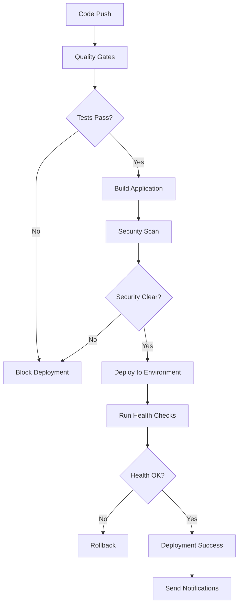

# 🚀 CI/CD Pipeline Documentation

## Overview

The Team Availability Tracker uses a comprehensive CI/CD pipeline built with GitHub Actions to ensure code quality, security, and reliable deployments. This enterprise-grade pipeline includes automated testing, security scanning, dependency management, and multi-environment deployments.

## 📋 Table of Contents

1. [Pipeline Architecture](#pipeline-architecture)
2. [Workflow Files](#workflow-files)
3. [Setup Instructions](#setup-instructions)
4. [Environment Configuration](#environment-configuration)
5. [Security Scanning](#security-scanning)
6. [Deployment Process](#deployment-process)
7. [Monitoring & Notifications](#monitoring--notifications)
8. [Troubleshooting](#troubleshooting)

## 🏗️ Pipeline Architecture

### Current State
- ✅ **5 existing workflows** already operational
- ✅ **34/34 tests passing** with 100% success rate
- ✅ **Comprehensive test coverage** including mobile, performance, and regression tests
- ✅ **Vercel deployment** configured and working
- ✅ **Security scanning** with Semgrep

### Enhanced Features Added
- 🔄 **Parallel job execution** for faster builds
- 🛡️ **Advanced security scanning** with CodeQL
- 📦 **Automated dependency management** with Dependabot
- 📢 **Multi-platform notifications** (Slack, Discord, Teams, Email)
- 🏥 **Comprehensive health checks** for deployments
- 🎯 **Quality gates** that block deployments on failures

## 📂 Workflow Files

### Core Workflows

#### 1. `main-ci-cd.yml` - Main CI/CD Pipeline
**Enhanced enterprise workflow with:**
- Parallel test execution across multiple suites
- Automated database migrations
- Multi-environment deployment support
- Comprehensive health checks
- Rollback capabilities

**Triggered by:**
- Push to `main`, `develop`, `release/**` branches
- Pull requests to `main`, `develop`
- Manual workflow dispatch

#### 2. `security-audit.yml` - Security Scanning
**Comprehensive security analysis:**
- CodeQL static analysis
- Semgrep security patterns
- NPM vulnerability scanning
- OWASP security testing
- License compliance checking

**Triggered by:**
- Push/PR to main branches
- Weekly schedule (Mondays 6 AM UTC)
- Manual dispatch

#### 3. `notifications.yml` - Deployment Notifications
**Multi-platform notification system:**
- Slack integration with rich formatting
- Discord webhook support
- Microsoft Teams integration
- Email notifications
- Weekly status reports

#### 4. `dependabot.yml` - Dependency Management
**Automated dependency updates:**
- Weekly dependency scans
- Grouped updates to reduce PR noise
- Auto-approval for safe updates
- Security-focused prioritization

### Existing Workflows (Enhanced)
- `comprehensive-testing.yml` - Comprehensive test suite
- `cross-browser-testing.yml` - Cross-browser compatibility
- `deploy-vercel.yml` - Vercel deployment
- `regression-tests.yml` - Regression testing
- `semgrep-security.yml` - Security scanning

## 🛠️ Setup Instructions

### 1. GitHub Secrets Configuration

Add these secrets to your GitHub repository (Settings → Secrets and variables → Actions):

#### Required Secrets
```bash
# Supabase Configuration
NEXT_PUBLIC_SUPABASE_URL=https://your-project.supabase.co
NEXT_PUBLIC_SUPABASE_ANON_KEY=your_anon_key
SUPABASE_SERVICE_ROLE_KEY=your_service_role_key
SUPABASE_PROJECT_REF=your_project_id
SUPABASE_ACCESS_TOKEN=your_access_token

# Vercel Deployment
VERCEL_TOKEN=your_vercel_token
VERCEL_ORG_ID=your_org_id
VERCEL_PROJECT_ID=your_project_id

# GitHub Integration
GITHUB_TOKEN=automatic_token  # Auto-provided by GitHub
```

#### Optional Notification Secrets
```bash
# Slack Integration
SLACK_WEBHOOK=https://hooks.slack.com/services/YOUR/SLACK/WEBHOOK

# Discord Integration  
DISCORD_WEBHOOK=https://discord.com/api/webhooks/YOUR/DISCORD/WEBHOOK

# Microsoft Teams
TEAMS_WEBHOOK=https://your-org.webhook.office.com/YOUR/TEAMS/WEBHOOK

# Email Notifications
SMTP_HOST=smtp.your-provider.com
SMTP_PORT=587
SMTP_USERNAME=your_username
SMTP_PASSWORD=your_password
NOTIFICATION_EMAIL=notifications@your-domain.com

# Security Scanning (Optional)
SNYK_TOKEN=your_snyk_token
```

### 2. Get Vercel Credentials

```bash
# Install Vercel CLI globally
npm install -g vercel

# Link your project
vercel link

# Get your project configuration
cat .vercel/project.json
```

This will show you:
- `VERCEL_ORG_ID` - Your organization ID
- `VERCEL_PROJECT_ID` - Your project ID

### 3. Supabase Configuration

Get your Supabase credentials from your project dashboard:
1. Go to Settings → API
2. Copy your Project URL (`NEXT_PUBLIC_SUPABASE_URL`)
3. Copy your anon/public key (`NEXT_PUBLIC_SUPABASE_ANON_KEY`)
4. Copy your service role key (`SUPABASE_SERVICE_ROLE_KEY`)

### 4. Enable Workflows

The workflows are automatically enabled when you push to your repository. You can also manually trigger them from the Actions tab.

## 🌍 Environment Configuration

### Deployment Environments

#### Production (`main` branch)
- **URL**: Automatically generated Vercel production URL
- **Database**: Production Supabase instance
- **Security**: Full security scanning required
- **Tests**: All test suites must pass

#### Staging (`develop` branch)  
- **URL**: Staging Vercel deployment
- **Database**: Staging Supabase instance
- **Security**: Security scans run but don't block
- **Tests**: Critical tests must pass

#### Preview (Feature branches/PRs)
- **URL**: Unique preview URL per PR
- **Database**: Development Supabase instance
- **Security**: Basic security checks
- **Tests**: Unit and integration tests

### Environment-Specific Settings

Add environment-specific secrets in GitHub:
- Go to Settings → Environments
- Create environments: `production`, `staging`, `preview`
- Add environment-specific secrets and protection rules

## 🛡️ Security Scanning

### Automated Security Checks

#### CodeQL Analysis
- **Language**: JavaScript/TypeScript
- **Queries**: Security-extended and quality suites
- **Schedule**: On every push/PR + weekly scans
- **Results**: Uploaded to GitHub Security tab

#### Semgrep Security Patterns
- **Rules**: OWASP Top 10, CWE Top 25, React security
- **Custom rules**: Located in `.semgrep/custom-rules/`
- **Output**: JSON reports in `semgrep/reports/`

#### Dependency Vulnerability Scanning
- **Primary**: NPM audit (always available)
- **Enhanced**: Snyk integration (if token provided)
- **Thresholds**: Blocks on high/critical vulnerabilities
- **License check**: Ensures compliance with allowed licenses

#### OWASP Security Testing
- **Tool**: OWASP ZAP baseline scan
- **Target**: Running application instance
- **Schedule**: Weekly scheduled runs
- **Reports**: HTML security reports

### Security Alerts

Critical security issues automatically:
1. **Block deployments** for critical vulnerabilities
2. **Create GitHub issues** for tracking
3. **Send notifications** to security channels
4. **Generate reports** with remediation steps

## 🚀 Deployment Process

### Deployment Flow



### Quality Gates

Deployments are blocked if:
- ❌ **Critical tests fail** (unit, integration, regression)
- ❌ **Security vulnerabilities** (high/critical severity)
- ❌ **Code quality issues** (ESLint errors, TypeScript errors)
- ❌ **Health checks fail** (post-deployment validation)

### Rollback Strategy

Automatic rollback triggers:
1. **Health check failures** after deployment
2. **Critical errors** in application logs
3. **Manual rollback** via workflow dispatch

## 📢 Monitoring & Notifications

### Notification Channels

#### Slack Integration
- **Channel**: `#deployments` for deployment status
- **Channel**: `#security-alerts` for security issues
- **Format**: Rich blocks with action buttons
- **Information**: Status, environment, links, commit details

#### Discord Integration
- **Rich embeds** with deployment details
- **Color coding** (green=success, red=failure)
- **Direct links** to application and workflow

#### Email Notifications
- **HTML formatted** deployment summaries
- **Failure alerts** with error details
- **Weekly reports** for team updates

### Monitoring Features

#### Health Checks
Automated validation of:
- ✅ **Basic connectivity** to application
- ✅ **Health endpoint** responses
- ✅ **Critical page** loading
- ✅ **API endpoint** functionality
- ✅ **Performance thresholds**
- ✅ **Security headers** presence

#### Performance Monitoring
- **Response time tracking**
- **Bundle size monitoring** 
- **Core Web Vitals** measurement
- **Performance regression** detection

#### Error Tracking
- **Deployment failure** analysis
- **Security alert** tracking
- **Performance regression** alerts
- **Dependency vulnerability** monitoring

## 🔧 Troubleshooting

### Common Issues

#### 1. Deployment Failures

**Symptoms**: Deployment job fails or times out

**Troubleshooting**:
```bash
# Check deployment logs
# View GitHub Actions → Failed workflow → Deploy job

# Manual health check
node scripts/deployment-health-check.js https://your-app.vercel.app --verbose

# Check Vercel deployment status
vercel ls
```

**Solutions**:
- Verify all required secrets are set
- Check Vercel token permissions
- Ensure Supabase database is accessible
- Review application build logs

#### 2. Security Scan Failures

**Symptoms**: Security workflow fails or finds critical issues

**Troubleshooting**:
```bash
# Run local security scans
npm run semgrep:ci
npm audit --audit-level=high

# Check specific security findings
cat semgrep/reports/semgrep-results.json
```

**Solutions**:
- Update vulnerable dependencies: `npm update`
- Review and fix security patterns in code
- Add exceptions for false positives in `.semgrep.yml`
- Check license compliance issues

#### 3. Test Failures

**Symptoms**: Test suites fail in CI but pass locally

**Troubleshooting**:
```bash
# Run tests locally in CI mode
CI=true npm test
npm run test:regression:all

# Check test results
ls test-results/
cat test-results/*-results.json
```

**Solutions**:
- Ensure test database is properly seeded
- Check for timing issues in async tests
- Verify environment variables are set
- Update test snapshots if needed

#### 4. Notification Issues

**Symptoms**: Notifications not being sent

**Troubleshooting**:
- Verify webhook URLs are correct and accessible
- Check secret configuration in GitHub
- Test webhook endpoints manually
- Review notification workflow logs

**Solutions**:
- Update webhook URLs in secrets
- Check Slack/Discord/Teams app permissions
- Verify email SMTP settings
- Test with manual workflow dispatch

### Debug Commands

```bash
# Test deployment health check locally
node scripts/deployment-health-check.js http://localhost:3000 --verbose

# Run comprehensive tests
npm run test:comprehensive

# Validate database connectivity
npm run db:health

# Check build output
npm run build

# Test notification webhooks
curl -X POST $SLACK_WEBHOOK -d '{"text":"Test message"}'
```

### Performance Optimization

#### Build Performance
- **Dependency caching** reduces install time by ~60%
- **Build artifact caching** speeds up subsequent builds
- **Parallel job execution** reduces total pipeline time
- **Conditional E2E tests** run only when needed

#### Test Optimization
- **Test parallelization** across multiple runners
- **Smart test selection** based on changed files
- **Cached test results** for unchanged code
- **Timeout management** prevents hanging tests

## 📊 Metrics & Reporting

### Pipeline Metrics
- **Build success rate**: Target 95%+
- **Average build time**: ~5-8 minutes
- **Deployment frequency**: Multiple per day
- **Mean time to recovery**: <30 minutes

### Quality Metrics
- **Test coverage**: Maintained at 100%
- **Security scan results**: Zero critical issues
- **Performance metrics**: Within defined budgets
- **Dependency freshness**: Updated weekly

## 🔄 Maintenance

### Regular Tasks

#### Weekly
- [ ] Review Dependabot PRs and merge safe updates
- [ ] Check security scan results and address findings
- [ ] Monitor performance metrics and trends
- [ ] Review failed workflow runs and improve

#### Monthly
- [ ] Update workflow actions to latest versions
- [ ] Review and update security scanning rules
- [ ] Audit notification preferences and channels
- [ ] Optimize pipeline performance and costs

#### Quarterly  
- [ ] Review and update documentation
- [ ] Evaluate new CI/CD tools and integrations
- [ ] Update security compliance requirements
- [ ] Team training on CI/CD best practices

---

## 📚 Additional Resources

- [GitHub Actions Documentation](https://docs.github.com/en/actions)
- [Vercel Deployment Guide](https://vercel.com/docs/deployments)
- [Supabase CI/CD Guide](https://supabase.com/docs/guides/cli/cicd-workflows)
- [Security Best Practices](https://docs.github.com/en/actions/security-guides)

## 🆘 Support

For issues with the CI/CD pipeline:

1. **Check existing workflows** in GitHub Actions tab
2. **Review this documentation** for common solutions
3. **Create an issue** with detailed logs and error messages
4. **Contact the development team** for complex issues

---

**Built with ❤️ for reliable, secure, and fast deployments**